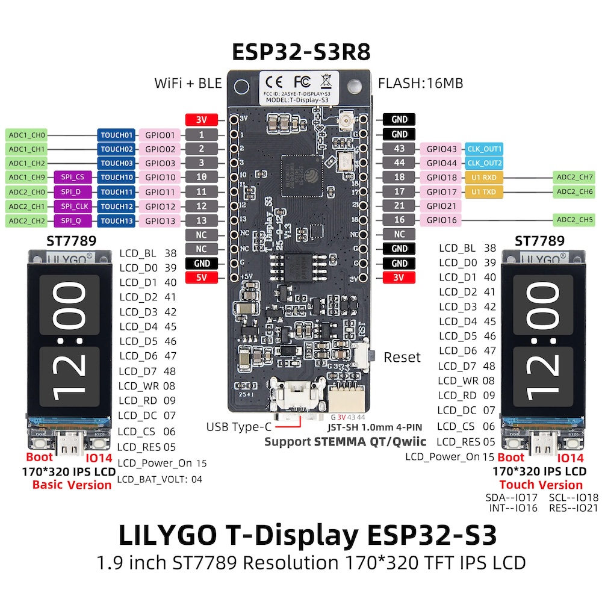

# BananaPhon / MIDI-Device


Ein Touch-MIDI-Instrument auf Basis des **LilyGo T-Display S3**
(ESP32-S3): Bis zu sieben kapazitive Touch-Sensoren — zum Beispiel
Gemüse — lösen MIDI-Noten aus, die drahtlos per **BLE-MIDI** und
**RTP-MIDI (AppleMIDI)** an einen Computer oder ein iPad gesendet
werden. Ohne verbundenes MIDI-Ziel spielt ein eingebauter
**Chiptune-Synthesizer** über einen Lautsprecher — das BananaPhon ist
damit auch ganz ohne Computer ein Instrument. Das Display zeigt die
Klaviatur, den Verbindungsstatus und den Batteriestand.

## Features

- **7 Touch-Eingänge** über die internen Touch-Pins des ESP32-S3,
  mit automatischer Baseline-Kalibrierung beim Start und Hysterese
  gegen Prellen
- **Baseline-Nachführung**: die Ruhewerte folgen langsamer Drift
  (austrocknendes Gemüse, Temperatur) automatisch; der untere
  Board-Button (GPIO 14) kalibriert jederzeit manuell neu — z. B.
  nach dem Umstecken auf neues Gemüse
- **Anschlagsdynamik**: die Velocity wird aus der Touch-Intensität
  abgeleitet (Kontaktfläche) — ein satter Griff klingt lauter als eine
  Fingerspitze; per Peak-Fenster (~10 ms) wird der Spitzenwert des
  Anschlags erfasst
- **Aftertouch**: der Druck wird auch *während* einer gehaltenen Note
  weiter ausgewertet — fester zugreifen lässt den Ton anschwellen,
  lockern nimmt ihn zurück. Per MIDI als Channel Pressure, am
  Lautsprecher als Lautstärke-Modulation der einzelnen Stimme. Der
  Bezugspunkt ist der eingeschwungene Griff, nicht die Anschlagsspitze,
  damit die Anschlagsdynamik erhalten bleibt und der Druck nur die
  Änderung ausdrückt
- **BLE-MIDI**: erscheint als Bluetooth-MIDI-Gerät (macOS, iOS, Windows 10+)
- **FM-E-Piano**: 2-Operator-FM im DX7/Rhodes-Stil — heller,
  glockiger Anschlag (fallender Modulationsindex), der bei gehaltener
  Taste über ~2 s weich ausklingt; Skala, Oktave und Arpeggio wirken
  wie beim Chip-Sound
- **Drumkit-Modus**: die sieben Pads werden zu Kick, Snare, HiHats
  (zu/offen), zwei Toms und Clap — per MIDI als General-MIDI-
  Percussion auf Kanal 10 (jede DAW spielt sofort ein echtes
  Schlagzeug), am Lautsprecher als 808-Stil-Synthese: Sinus mit
  Tonhöhen-Hüllkurve auf einen Sockel (die Kick fällt von 170 auf
  50 Hz und *bleibt* dort, statt in den Subbass wegzulaufen) plus
  LFSR-Rauschen, tiefpassgefiltert für Snare und Toms,
  hochpassgefiltert für HiHats und Clap. Dazu die Details, die ein Kit
  glaubwürdig machen: der Clap besteht aus drei gestaffelten Anschlägen
  im 10-ms-Raster statt einem, die geschlossene HiHat würgt die offene
  ab wie auf einem echten Kit, und die Anschlagstärke steuert nicht nur
  die Lautstärke, sondern auch die Helligkeit der Felle. Kit-Rezepte in
  [`include/Drums.h`](include/Drums.h)
- **Standalone-Betrieb mit Lautsprecher**: ohne verbundenes
  MIDI-Ziel spielt ein I2S-Verstärker (MAX98357A) die Noten direkt —
  polyphon mit einer Stimme pro Pad, Wellenform wählbar (Default:
  8-Bit-Chiptune), Velocity steuert die Lautstärke; Lautsprecher-Icon
  in der Statusleiste zeigt den Modus
- **Settings-Menü am Rotary-Encoder** (EC11/KY-040, per
  PCNT-Hardware in voller Quadratur ausgewertet): Klick öffnet das
  Menü (auf dem zuletzt benutzten Parameter) und wechselt zwischen
  **Sound** (Chip/Drums/Piano), **Wellenform**
  (Dreieck/Rechteck/Sägezahn/Sinus/8-Bit-Chiptune), **Arpeggio**
  (Off/Slow/Fast/Turbo — gehaltene Akkorde werden im C64-Stil als
  schnelle Notenfolge zerlegt), **Skala** (Dur, Moll,
  Pentatonik, Blues) und **Oktave** (±2), Drehen
  ändert den Wert; die Lautstärke regelt Drehen bei
  geschlossenem Menü direkt (Schnellzugriff). Alle Werte landen im NVS-Flash und überleben
  Neustarts — konfigurieren statt kompilieren
- **WLAN-Setup ohne Neu-Flashen**: kommt keine Verbindung zustande,
  öffnet das Gerät ein Captive Portal (AP "BananaPhon",
  http://192.168.4.1, Zahnrad-Icon in der Statusleiste) — dort eingetragene Zugangsdaten überleben
  Neustarts; BLE-MIDI läuft währenddessen weiter
- **RTP-MIDI / AppleMIDI** über WLAN inkl. Bonjour/mDNS-Discovery:
  erscheint im Audio-MIDI-Setup (macOS) bzw. in [rtpMIDI](https://www.tobias-erichsen.de/software/rtpmidi.html) (Windows)
- **USB-Host-MIDI** (optional): ein externes MIDI-Gerät kann an den
  ESP32 angeschlossen werden
- **Splash-Screen** beim Start (mindestens 2 s) mit Gerätename und
  Firmware-Version; Touch-Kalibrierung und Funk-Initialisierung laufen
  währenddessen im Hintergrund
- **Display-UI**: Pads mit Notennamen — beim Anschlag füllen sie sich
  von unten proportional zur Velocity (grün/gelb/rot, VU-Stil), nach
  dem Loslassen hält ein Peak-Marker die letzte Höhe kurz und fällt
  dann animiert nach unten —, Pads im Klavier-Look (weiße Tasten, unten
  gerundet, mit Deko-Obertasten über den Fugen), Notennamen im
  unteren Tasten-Bereich, Status-Icons mittig in der oberen Leiste
  (Bluetooth, WLAN, Note für RTP, Zahnrad fürs Setup-Portal,
  Lautsprecher für den Standalone-Betrieb), Batterieanzeige mit
  Ladestand bzw. USB-Erkennung

## Hardware

- LilyGo T-Display S3 (Version **ohne** Touchscreen)
- MAX98357A I2S-Verstärker + 3-W-Lautsprecher (4 Ω) für den
  Standalone-Betrieb
- KY-040/EC11 Rotary-Encoder
- Optional: 1S-LiPo-Akku am JST-Anschluss
- 7 Elektroden (Krokodilklemmen ans Gemüse der Wahl)

| | | |
|---|---|---|
|  |  |  |
| LilyGo T-Display S3 | MAX98357A I2S-Verstärker | KY-040 Rotary-Encoder |

### Pinbelegung

Die MIDI-Noten in der Tabelle gelten für die Werkseinstellung (Skala
Dur, Oktave 0); Skala und Oktav-Shift verschieben sie zur Laufzeit. Im
Drumkit-Modus sendet jedes Pad stattdessen seine GM-Percussion-Note auf
Kanal 10 (siehe [`include/Drums.h`](include/Drums.h)).

| GPIO | Funktion | MIDI-Note |
|------|----------|-----------|
| 1    | Touch-Sensor 1 | C4 (60) |
| 2    | Touch-Sensor 2 | D4 (62) |
| 3    | Touch-Sensor 3 | E4 (64) |
| 10   | Touch-Sensor 4 | F4 (65) |
| 11   | Touch-Sensor 5 | G4 (67) |
| 12   | Touch-Sensor 6 | A4 (69) |
| 13   | Touch-Sensor 7 | H4 (71) |
| 4    | Batteriespannung (intern, 2:1-Teiler) | — |
| 21   | I2S BCLK → MAX98357A | — |
| 17   | I2S LRC → MAX98357A | — |
| 16   | I2S DIN → MAX98357A | — |
| 44   | Encoder A | — |
| 18   | Encoder B | — |
| 43   | Encoder SW (Taster) | — |
| 14   | Board-Button: Rekalibrierung | — |

Der MAX98357A braucht zusätzlich 5V und GND; der Gain-Pin kann offen
bleiben (9 dB). Encoder-Taster gegen GND, Pull-ups sind intern gesetzt.
GPIO 43/44 sind U0TXD/U0RXD — frei nutzbar, weil der serielle Monitor
auf dem S3 über natives USB-CDC läuft.

Mehr interne Touch-Pins gibt es auf diesem Board nicht — GPIO 5–9
gehören dem Display, GPIO 14 dem zweiten Button (hier: Rekalibrierung).
Für mehr Eingänge bietet sich ein externer Touch-Controller
(z. B. MPR121, I2C) an.

## Setup

Voraussetzung: [PlatformIO](https://platformio.org/) (CLI oder VS-Code-Extension).

```sh
git clone https://github.com/carsten-walther/BananaPhon.git
cd BananaPhon

# WLAN-Zugangsdaten anlegen (bleiben lokal, sind gitignoriert)
cp include/Credentials.example.h include/Credentials.h
# → include/Credentials.h ausfüllen — oder SSID leer ("") lassen und
#   das WLAN später bequem über das Setup-Portal einrichten

# Bauen und flashen
pio run -t upload

# Serieller Monitor (Baseline-Werte, Verbindungsstatus)
pio device monitor
```

**Wichtig beim Start:** Während des Splash-Screens (mindestens 2
Sekunden, `SPLASH_MS`, mit Name und Firmware-Version) werden die
Sensoren im Hintergrund kalibriert. Das Gemüse muss dabei schon angeschlossen sein, darf aber
nicht berührt werden — der Splash weist darauf hin.

Im Betrieb führt die Firmware die Ruhewerte automatisch langsam nach
(einstellbar über `TOUCH_BASELINE_INTERVAL_MS` / `TOUCH_BASELINE_FILTER`
in `Config.h`). Nach größeren Änderungen — neues Gemüse, umgesteckte
Klemmen — genügt ein Druck auf den **unteren Board-Button**: alle
Sensoren werden neu kalibriert, dabei ebenfalls nicht berühren.

## MIDI verbinden

**BLE (macOS):** Audio-MIDI-Setup → Fenster → MIDI-Studio →
Bluetooth-Symbol → „BananaPhon" verbinden.

**RTP-MIDI (macOS):** Audio-MIDI-Setup → MIDI-Studio → Netzwerk-Symbol →
das Gerät erscheint per Bonjour im Verzeichnis → verbinden.

**RTP-MIDI (Windows):** [rtpMIDI](https://www.tobias-erichsen.de/software/rtpmidi.html)
installieren, das Gerät erscheint im Verzeichnis.

## Konfiguration

Alle Einstellungen liegen in [`include/Config.h`](include/Config.h):

- Transports einzeln schaltbar (`ENABLE_BLE_MIDI`, `ENABLE_WIFI_MIDI`,
  `ENABLE_USB_MIDI`)
- Gerätename, MIDI-Kanal, Velocity
- Anschlagsdynamik (`ENABLE_TOUCH_VELOCITY`, Spanne `VELOCITY_MIN` /
  `VELOCITY_MAX`, Kennlinie `TOUCH_VELOCITY_RATIO_MAX`, Peak-Fenster
  `TOUCH_VELOCITY_WINDOW_MS`, Peak-Hold-Marker
  `ENABLE_VELOCITY_PEAK_HOLD` mit Haltezeit `VELOCITY_PEAK_HOLD_MS`
  und Fallgeschwindigkeit `VELOCITY_PEAK_FALL_*`) — der serielle Monitor zeigt die
  gesendete Velocity pro NoteOn zum Einstellen der Kennlinie
- Aftertouch (`ENABLE_AFTERTOUCH`, Glättung `AFTERTOUCH_FILTER`,
  Einschwingzeit bis zum Bezugspunkt `AFTERTOUCH_SETTLE_MS`, Sendetakt
  `AFTERTOUCH_INTERVAL_MS` und Mindeständerung `AFTERTOUCH_DEADBAND`
  gegen MIDI-Fluten, Modulationsbereich am Lautsprecher
  `AFTERTOUCH_SPEAKER_MIN` / `_MAX`)
- Grundton der Skalen (`SCALE_ROOT_NOTE`), Intervalltabellen in
  [`include/Scales.h`](include/Scales.h); Pin-Zuordnung der Sensoren;
  Notennamen auf dem Display
  wahlweise deutsch (H4) oder englisch (B4) via `USE_GERMAN_NOTE_NAMES`
- Touch-Empfindlichkeit (`TOUCH_ON_RATIO` / `TOUCH_OFF_RATIO`),
  Kalibrier-Stichproben (`TOUCH_CALIBRATION_SAMPLES`) und der
  Glitch-Filter `TOUCH_CONFIRM_SAMPLES` (so viele Messungen in Folge
  müssen über der Schwelle liegen, bevor eine Note startet — 1 = aus)
- Baseline-Nachführung (`TOUCH_BASELINE_INTERVAL_MS` = 0 schaltet sie ab,
  `TOUCH_BASELINE_FILTER` bestimmt die Trägheit)
- Lautsprecher (`ENABLE_SPEAKER`, I2S-Pins, `SPEAKER_SAMPLE_RATE`,
  `SPEAKER_MASTER_VOLUME`, Hüllkurve `SPEAKER_ATTACK_MS` /
  `SPEAKER_RELEASE_MS`)
- Rotary-Encoder (`ENABLE_ENCODER`, Pins, `ENCODER_STEPS_PER_DETENT`,
  `ENCODER_VOLUME_STEP`)
- Arpeggio-Stufen (`ARP_STEP_MS`)
- Splash-Screen (`SPLASH_MS`) und Firmware-Version (`FIRMWARE_VERSION`)
- Settings-Menü (`MENU_TIMEOUT_MS`, Oktavbereich `OCTAVE_RANGE`);
  die Defaults für Lautstärke/Wellenform gelten bis zur ersten
  Änderung im Menü, danach zählen die im NVS gespeicherten Werte
- Display (`DISPLAY_ROTATION`, `DISPLAY_BRIGHNESS`, Einblenddauer
  `DISPLAY_TOAST_MS`) und Batterie-Messintervall (`BATTERY_UPDATE_MS`)

Instrumentspezifisches liegt in [`include/Drums.h`](include/Drums.h):

- Drumkit: GM-Notennummern (`drumNotes`), Tastenkürzel (`drumLabels`)
  und die Synthese-Rezepte (`drumSpecs`) — je Drum Startfrequenz und
  Sockel des Tonhöhen-Sweeps (`freq` / `pitchFloor`), Tonhöhen- und
  Amplituden-Abfall, Ton-/Rausch-Mischung, Rauschfilter
  (`noiseLpf` als Koeffizient, `noiseHp` schaltet auf Hochpass),
  Mehrfach-Anschlag (`bursts` / `burstMs`), Choke-Ziel (`chokes`,
  -1 = keins) und Pegel-Ausgleich. Dazu `DRUM_CHOKE_DECAY`
  (Ausklingen einer abgewürgten Drum) und `DRUM_VEL_TONE_MIN`
  (wie stark die Anschlagstärke die Helligkeit öffnet)
- FM-E-Piano: Modulationsverhältnis (`PIANO_MOD_RATIO`), Anschlagsglanz
  (`PIANO_INDEX_START` / `_FLOOR` / `_DECAY`) sowie Ausklingen und
  Release (`PIANO_DECAY`, `PIANO_RELEASE`)

**Hinweis zu USB-Host-MIDI:** Der USB-C-Port wird dann exklusiv vom
USB-Host belegt — der serielle Monitor funktioniert nicht mehr, und es
wird ein OTG-Adapter benötigt.

## Projektstruktur

```
include/Config.h            zentrale Konfiguration
include/Credentials.h       WLAN-Zugangsdaten (lokal, gitignoriert)
include/Scales.h            Skalen (Intervalltabellen, Pad → Note)
include/Drums.h             Instrumente, Drumkit-Rezepte, FM-Piano-Parameter
src/main.cpp                Verdrahtung: Touch → MIDI + Display
src/TouchSensor.*           Touch-Logik (ESP32-S3, Baseline + Hysterese)
src/MidiController.*        MIDI-Transports (BLE, RTP, USB-Host)
src/SpeakerController.*     Standalone-Synth über I2S (MAX98357A)
src/EncoderController.*     Rotary-Encoder (PCNT-Quadraturzähler)
src/MenuController.*        Settings-Menü (Encoder-Bedienung)
src/Settings.*              persistente Einstellungen (NVS)
src/DisplayController.*     Panel-Konfiguration und UI
scripts/format.py           Format-Target und compiledb-Hook
```

## Entwicklung

```sh
pio run              # Bauen
pio run -t format    # Code formatieren (clang-format, .clang-format)
pio check            # Statische Analyse (cppcheck)
pio run -t compiledb # compile_commands.json für clangd erzeugen
```

Das Projekt wird mit **C++17** gebaut (`build_flags` in der
`platformio.ini`); die CI prüft Build, cppcheck und clang-format
bei jedem Push.

### WLAN-Setup-Portal

Ist keine SSID einkompiliert oder schlägt die Verbindung 30 Sekunden
lang fehl, spannt das Gerät einen Access Point auf und zeigt ein magentafarbenes
**Zahnrad** in der Statusleiste. Dann: mit dem WLAN „BananaPhon" verbinden,
http://192.168.4.1 öffnen, eigenes WLAN auswählen und Passwort
eintragen. Die Daten landen im Flash des ESP32 — beim nächsten Start
verbindet sich das Gerät direkt. Eine in `Credentials.h` eingetragene
SSID hat immer Vorrang vor den Portal-Daten. Abschaltbar über
`ENABLE_WIFI_PORTAL` in `Config.h`.

Verwendete Bibliotheken:
[ESP32_Host_MIDI](https://github.com/sauloverissimo/ESP32_Host_MIDI),
[LovyanGFX](https://github.com/lovyan03/LovyanGFX),
[AppleMIDI](https://github.com/lathoub/Arduino-AppleMIDI-Library),
[WiFiManager](https://github.com/tzapu/WiFiManager)

## Lizenz

MIT — siehe [LICENSE](LICENSE).